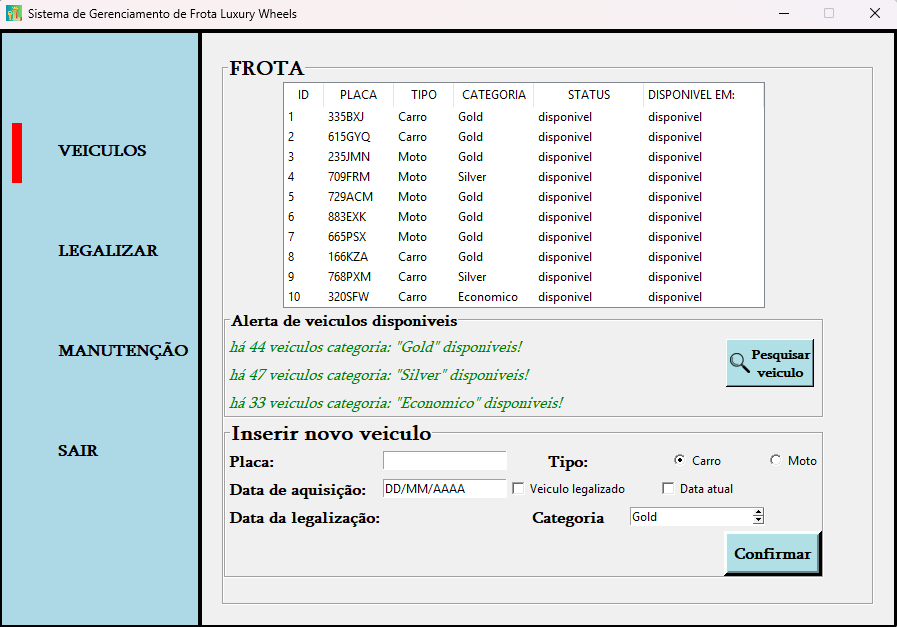

# luxury fleet manager

## Description

This project was my final project at Tokyo School, and also my first “complex” Python application.
It’s a car and bike rental management system built using Tkinter for the graphical interface and SQLite for the database.

The system allows managing vehicles, legalizations, and maintenance tasks, all through an intuitive interface.
It’s object-oriented (POO), with classes representing vehicles, clients, and internal operations — a great learning experience in modular code design.

Although the project is finished and graded, I’m now revisiting it to improve the structure and readability, as I’ve gained more programming experience since its first version.
## Preview



## Features

Login

There’s a registration system, but you can test the program using the following credentials:  
Username: ```admin```  
Password: ```admin```  

Vehicles

Displays all registered vehicles in a table  
Shows the number of available vehicles by type (Gold, Silver, Econômico)  
Includes a search function and an option to add new vehicles  

Legalize

Lists vehicles that need legalization  
Allows you to “legalize” selected vehicles through a button  

Maintenance

Shows vehicles that require maintenance  
Option to send vehicles to maintenance directly from the interface  

Logout

Two options: Quit or Logout (Go back to the login menu)

## Usage

Run the app using:  

```python3 app.py```

## Technologies Used

Python 3  
Tkinter – GUI interface  
SQLite3 – Local database  
OOP (Object-Oriented Programming) – Code structure and modularity  

## Lessons Learned

Practical use of OOP principles in a complete project  
Database integration and persistence with SQLite  
GUI design and event handling with Tkinter  
Code organization and modularization  

## Current Status

Project finished and graded  
🔄 Currently improving structure and adding new features  
💻 Works best on Windows — Linux optimization in progress  
